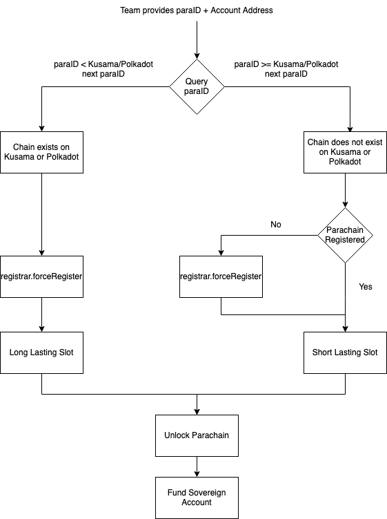

# PARA-ONBOARDING
The logic in this repo implements the following flow for onboarding parachains to substrate based relay chain

-   [ ] Team provides paraID + Account Address
-   [ ] Query paraID to see if chain exists on Kusama/Polkadot
-   [ ] ForceRegister for either a Long or Short lasting slot
-   [ ] Unblock Parachain + Fund Sovereign Account with $ROC
-   [ ] Daily tasks - Open all HRMP channels with active para sets

### CLI
See how to run the CLI locally [here](cli/README.md).

